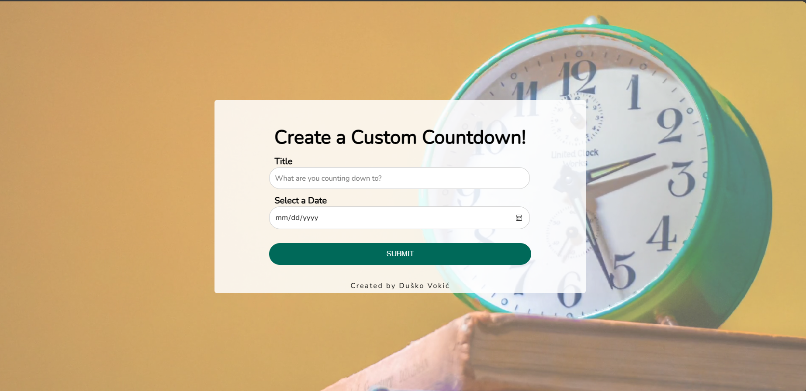

# Custom Countdown App

Welcome to the Custom Countdown App! This project is a customizable countdown timer built using HTML, CSS, and JavaScript. It allows users to set a specific countdown time and customize the display with different styling options.

## Demo

You can view a live demo of this project [here](https://d-vokic.github.io/Custom-Countdown-Timer/).

## Table of Contents

- [Custom Countdown App](#custom-countdown-app)
  - [Demo](#demo)
  - [Table of Contents](#table-of-contents)
  - [Features](#features)
  - [Getting Started](#getting-started)
    - [Prerequisites](#prerequisites)
    - [Installation](#installation)
  - [Usage](#usage)
  - [Deployment](#deployment)
  - [Built With](#built-with)
  - [Contributing / Support](#contributing--support)
  - [Author](#author)
  - [License](#license)
  
## Features

- Set a custom countdown time.
- Customize the timer display with various styling options.
- Start, pause, and reset the countdown timer.
- Responsive design for compatibility across devices.

## Getting Started

These instructions will get you a copy of the project up and running on your local machine for development and testing purposes.

### Prerequisites

What things you need to install the software and how to install them:

- A modern web-browser (Chrome, Firefox, Safari, Edge)

### Installation

1. Clone this repository.
2. Navigate to the project directory.
3. Open `index.html` in your browser.

## Usage

1. Set your desired countdown time and styling options.
2. Click the "Submit" button to begin the countdown.
3. Use the "Reset" button as needed.

## Deployment

Add additional notes about how to deploy this on a live system.

## Built With

- [HTML](https://developer.mozilla.org/en-US/docs/Web/HTML) - The markup language used
- [CSS](https://developer.mozilla.org/en-US/docs/Web/CSS) - The style sheet language used
- [JavaScript](https://developer.mozilla.org/en-US/docs/Web/JavaScript) - The programming language used

## Contributing / Support

- If you're having any problem, please raise an issue on GitHub and the maintainers will help you out.
- Feel free to fork the repository and submit pull requests with any improvements or new features.

## Author

This amasing project is maintained by Duško Vokić. You can reach out to me on [GitHub](https://github.com/D-vokic?tab=repositories) or [LinkedIn](https://www.linkedin.com/in/du%C5%A1ko-voki%C4%87-0337a2106) for any queries or suggestions.

## License

This project is licensed under the MIT License - see the [LICENSE.md](LICENSE.md) file for details

